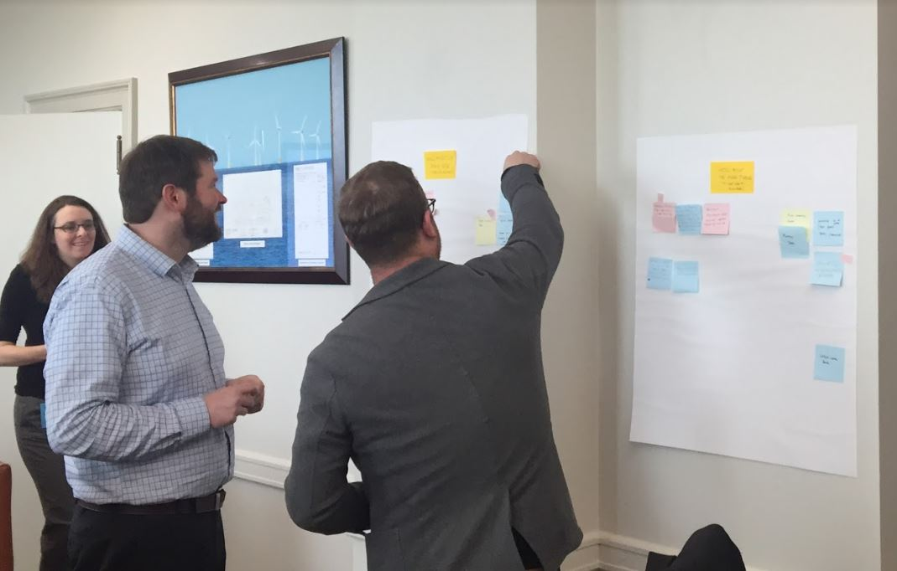

Two years ago, I was sitting in a conference room with members of [18F](https://18f.gsa.gov/). We had just spent the day strategizing and planning, coming up with long-term goals for the [Natural Resources Revenue Data (NRRD) website](https://revenuedata.doi.gov).

## Transition away from 18F

We started a discussion on the transition of site management from [18F](https://18f.gsa.gov/) to the Office of Natural Resources Revenue (ONRR). In the short term, it wasn’t so scary. We had hired a term-limited design team, the three members of which would be with us for 2 to 4 years, and from my perspective, it didn’t feel like the work was going to change all that much. But that's where I was wrong.

The last exercise of the day was assigning sticky notes with all the necessary website job functions to ONRR team members, but it couldn’t be any term-limited members. Our team – with the exception of the term-limited members – were program analysts who largely had data backgrounds and little to no experience in web design, content management, or web development.

I made more than one joke that day about how this was impossible.

One of the sticky notes placed on my name was content management. For the past 4 years, I had worked with 18F as a liaison, providing them data and content help when they were making additions to the site. But at the time, I rarely (if ever) signed into our code repository in GitHub, let alone made pull requests to the site.

## Codebase transition
About 6 months ago, we made the transition to a different [site generator](https://revenuedata.doi.gov/blog/homepage-revamp-part-two/), with a codebase allowing many of the content and data updates to be made by an analyst. The first few times I updated the site, I did so with one of the design team members looking over my shoulder and guiding me through the process. I was really unsure about what I was doing and how all the steps fit together. I never thought this would be something I could do on my own.

## Data Updates by data analysts
Fast forward to present day, and now one of my routine tasks is updating the monthly and annual revenue and production datasets. These updates affect all the [homepage graphs](https://revenuedata.doi.gov/), [the revenue table](https://revenuedata.doi.gov/explore/revenue/), [explore data pages](https://revenuedata.doi.gov/explore/), and all the [revenue](https://revenuedata.doi.gov/downloads/federal-revenue-by-location/) and [production downloads](https://revenuedata.doi.gov/downloads/federal-production/). Thanks to the refactoring of our codebase, it's now possible for a data analyst to replace an Excel file that updates the site with new data,  tasks that previously required the attention of a developer.

After the updates have been made to the site, we use GitHub and [Federalist](https://federalist.18f.gov/) to review previews of site changes. All the data posted to our site goes through several layers of data quality checks. Before my team receives the data, it’s already been reviewed by our data retrieval team, which pulls the data from ONRR’s database. Once we receive the data, a program analyst checks it for format and data anomalies before updating the site. Once the updated site is hosted on Federalist, a program analyst peer-reviews the site to ensure all the data is being displayed correctly and no bugs will be introduced to the live site.

So how did I get from being a data analyst to updating website data and content? Well, practice. Doing it myself allowed me to make mistakes and work my way out of them. I’ve previously used a content management system to update a different website, and I learned that this wasn’t all that different. I just had to use a few different programs to make the updates: a text editor to update the contextual information, the file explorer to get the files on the site, and GitHub Desktop to bring it all together, allowing the pull request to be reviewed by the team.

One of the most important things I was told several times was there wasn’t anything I could break, and though at times it felt like I’d broken something, I never did. If I hadn’t received this advice, I’d have been even more reluctant than I already was to try something completely new and outside my comfort zone. So if I could offer some tips: one, don’t worry about breaking anything. Two, shadow someone or have someone walk you through the process, explaining why you do each step. And finally, do it for yourself, make mistakes, and ask for help when you’re stuck.

I’m looking forward to making more contributions and growing my skill-set, because there was more than one sticky note on my name that day.
