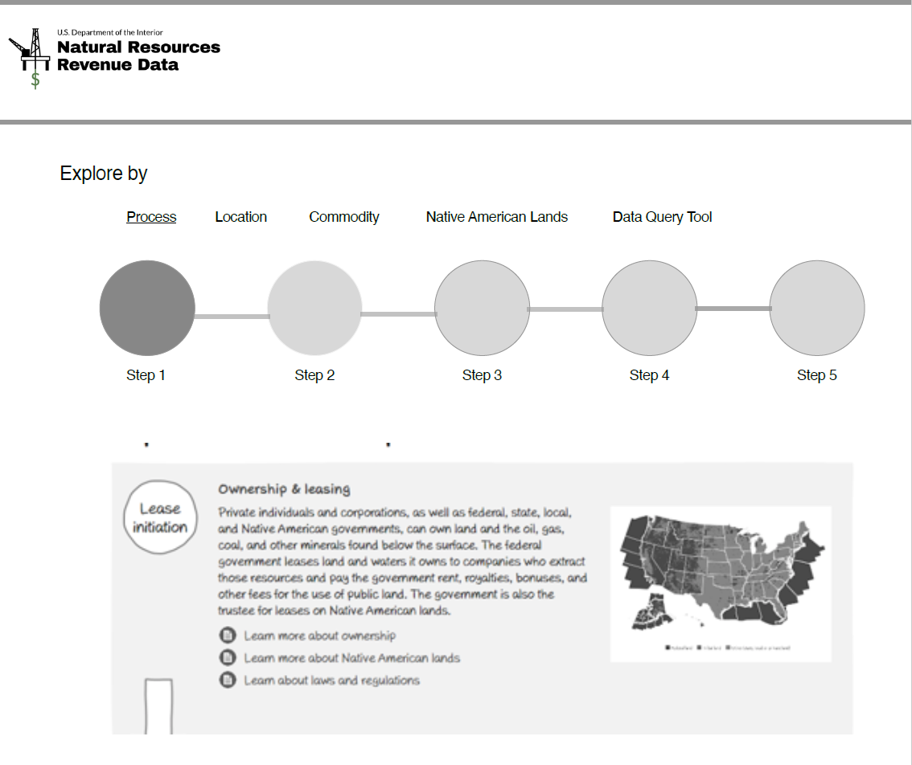
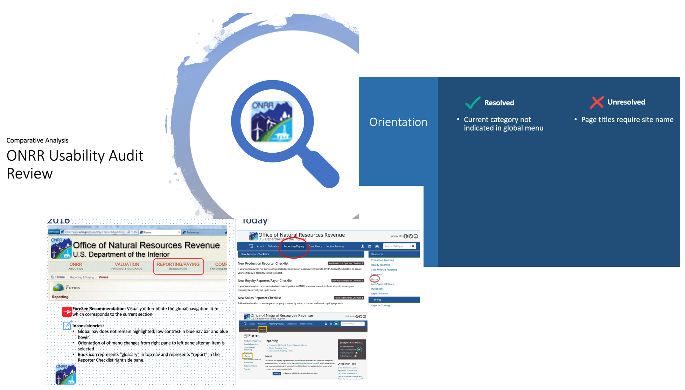
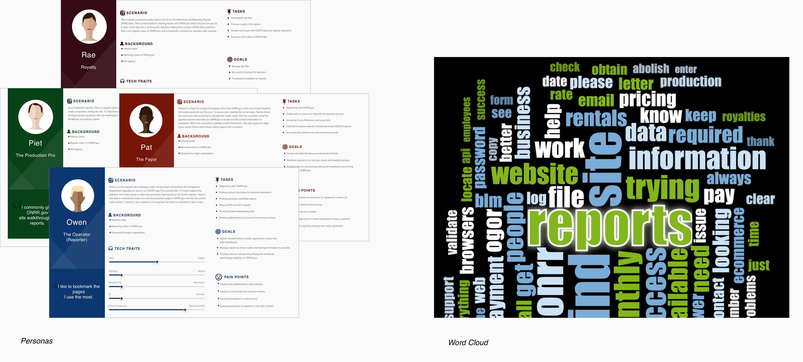
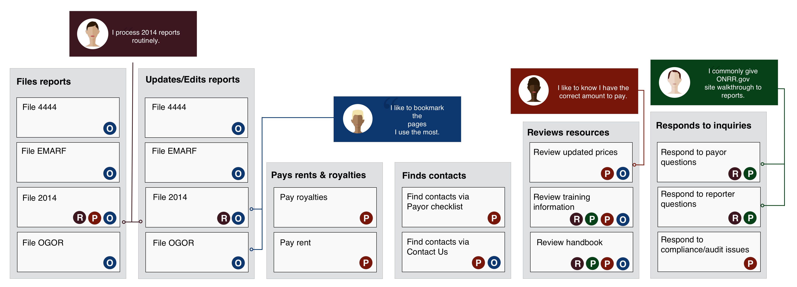
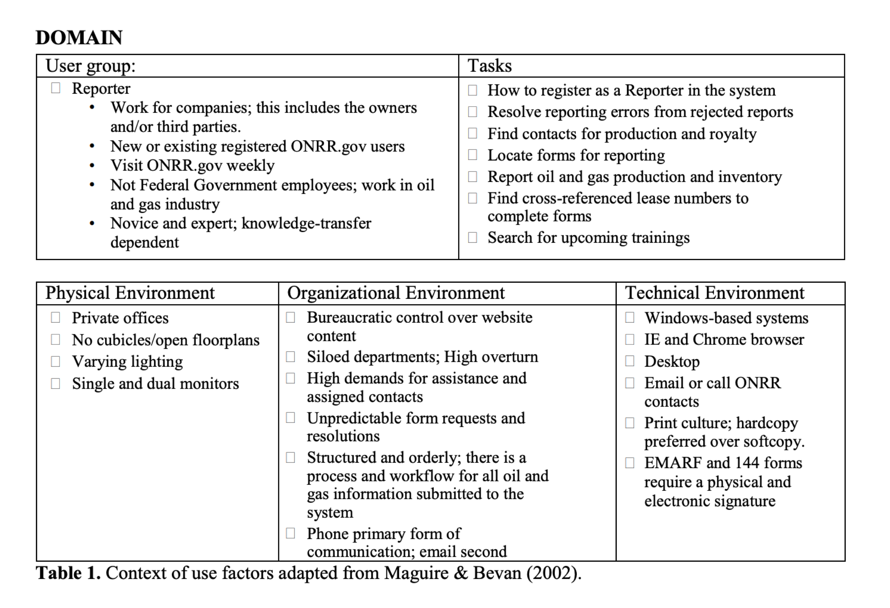
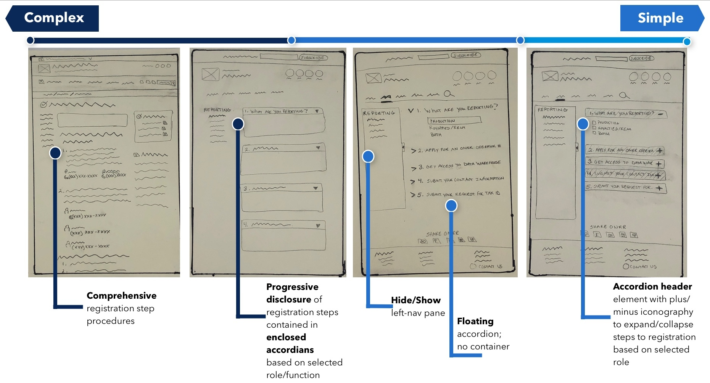
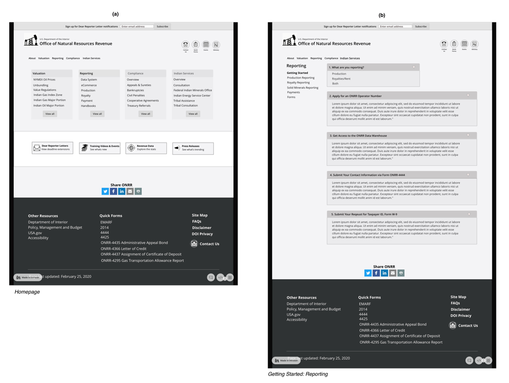
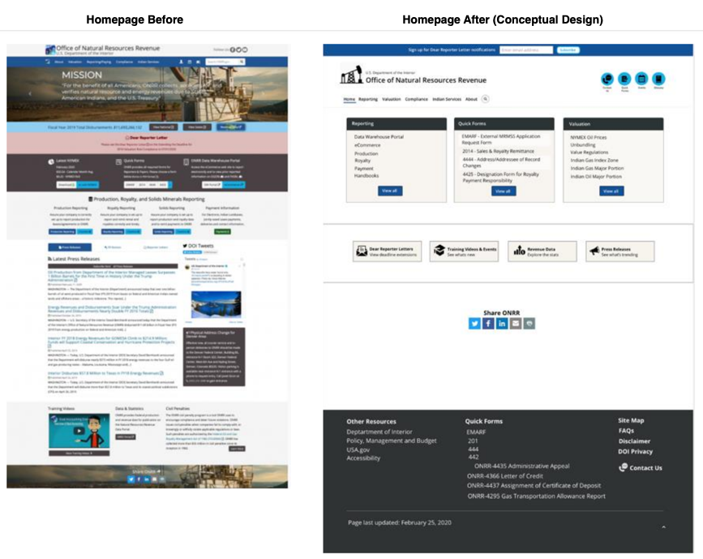
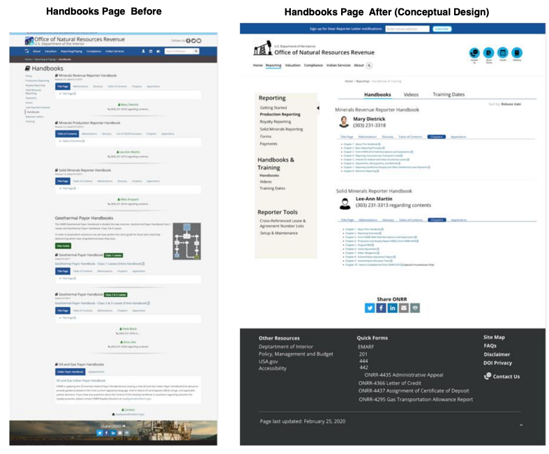

When I learned I had been selected for the user experience (UX) apprenticeship, I was incredibly excited about experiencing what it is like working within a federal government agency. Admittedly, my first impression of the material I’d be working with was that it was a little dry, but it wasn’t long after a deep exploration into ONRR.gov that I was hooked. The overall structure and navigation of the site needed some help and I was motivated by the opportunity it presented to design for impact with meaningful, evidence-based solutions. But most importantly, I wanted my work to improve the lives of those who interface with the product on an ongoing basis.

## The start of a journey
Getting settled into my new role, my world became a whirlwind of GitHub notifications, team meetings, and acronyms. My team was small, remote, and inspiringly efficient. Every week was an opportunity to share my status and learn more about the ways of working within an agency. In true agile fashion, we worked in two-week sprints with the flexibility to slow down the cadence and allow time for innovation, team alignment, and feedback on ideas and approaches. An example of this is when Shannon, the team’s UX Designer, led us in a [design studio UX workshop]( https://revenuedata.doi.gov/blog/remote-design-studio/) modeled after Basecamp’s free book, [Shape Up: Stop Running in Circles and Ship Work that Matters](https://basecamp.com/shapeup). In this workshop, everyone on the team--developers, program analysts, product managers, you name it--came together to ideate on solutions we would apply long-term. In a span of 4 two-hour meetings and the occasional homework assignment, everyone contributed in the design process to redesign the [Explore Data feature](https://beta-nrrd.app.cloud.gov/explore) on the Natural Resources Revenue Data site and build an improved, user-centered experience.

UX Workshop: My NRDD redesign exploration

The workshop exemplified the virtual collaboration, trust, and creative qualities of our team and the importance of engaging in every detail throughout the design development cycle. It also grounded how I would collaborate, design, and conduct user research throughout my UX apprenticeship.

## ONRR.gov discovery
Shortly before I started my internship, the team [took on the responsibility for a second site](https://revenuedata.doi.gov/blog/adding-a-product/), ONRR.gov. For my project, I was tasked with starting the discovery phase of learning more about the needs of ONRR.gov users. Part of this process included adopting design thinking in the exploration and development of design concepts that we would use in usability testing sessions.

[Design thinking](https://www.ideou.com/blogs/inspiration/what-is-design-thinking#:~:text=Design%20thinking%20is%20a%20process,%2C%20services%2C%20and%20internal%20processes.&text=Reduce%20the%20risk%20associated%20with,ideas%2C%20products%2C%20and%20services.) is a methodology we use in UX to approach finding solutions to problems through a broad lens of divergent ideas. As we gather, collect, and synthesize our data, our ideas converge into meaningful experiences we test, iterate, and test again. By its name, design thinking is commonly misunderstood as a method intended for designers. However, anyone can employ this method to explore solutions – you do not have to be a designer or working within the UX industry. In the following sections, I’ve outlined the stages of my design thinking process and some of the artifacts I was responsible for developing throughout my collaboration with the team in conceptualizing a new and meaningful re-designed ONRR.gov experience.

### Empathize
What exactly is the emotional design experience of using ONRR.gov? Can users find what they need? Are they lost, frustrated, or delayed in accomplishing tasks? What time is allotted to explore, learn, and find information to get the job done or develop professionally? To understand the mental model of the ONRR.gov user and to empathize with their needs, I analyzed self-reported data collected from user surveys that had been conducted a few years ago and compared the findings to the current state of the ONRR.gov site. This allowed us to assess what was still relevant vs. what had been resolved in the ONRR.gov site design and its performance. I observed user interviews while taking notes and participated in debriefing with the team to discuss our observations.

Comparative Analysis: Survey data vs. current state of ONRR.gov

Using the insights captured from self-reported survey data and interviews, I developed persona cards representing the behaviors, goals, tasks, and technological savviness of our ONRR.gov audience.  Specific terms, phrases, and verbatims from interviews and past surveys were recorded to generate a word cloud quantifying the terms most used by participants when discussing their experiences using ONRR.gov.

### Define
With a stronger sense of our participants’ pains, needs, and goals, I was ready to define the problem. To begin, I made a list of “How might we?” statements. For example:
*	How might we simplify the structure and organization of content on ONRR.gov?
*	How might we reduce friction in finding and locating frequently accessed reports, forms, and handbooks?

Next, I sorted our findings from participant interviews into a spine diagram illustrating the common tasks and the associated mental model of our personas.

Spine diagram: Illustrates mental model of personas and their tasks & goals.

The context of use table is another UX tool I used to identify important factors related to our participants’ needs and goals, environment, and technological constraints.

### Ideate
The functional purpose of ONRR.gov is to enable practitioners by providing them the tools and information required to be self-sufficient in completing tasks while minimizing dependencies. In exploring approaches to support this purpose, I conducted a competitive analysis of self-help knowledgebase systems.  Working my way from complex to simple, I sketched a few variations of how we might condense content in a more consumable format and structure. After a few iterations, I landed on a simple, clean design applying [Occam’s Razor design principle]( https://lawsofux.com/occams-razor), which says to choose the one that incorporates the fewest assumptions.

Sketch iterations: Working from complex to simple interactive design components and UI layout.

### Prototype
To build on concepts iteratively, we conducted a series of usability test sessions with [lo-fidelity wireframes]( https://projects.invisionapp.com/share/GNWBLFZC3FS#/screens/408441718) featuring 4 containers grouped by commonly accessed sections of ONRR.gov. Our strategy was to introduce a redesign with less information to learn what participants may be missing and if the existing information and its arrangement was meeting their expectations.

Lo- Fidelity Wireframes: Phase I conceptual lo-fidelity designs. From left to right: (a) Homepage with 4 containers grouping common sections; (b) Getting Started page with enclosed accordions using dynamic progressive disclosure for Reporter setup.

### Test
We learned from our first iteration of testing that the conceptual redesign met participants’ expectations. In our post-testing debrief sessions, the team agreed to make some further modifications to the design to condense the grouping of information from 4 cards to 3 with some re-arranging of the information hierarchy. I started iterating on the first version of our lo-fidelity wireframe and continued exploring what we might consider to group and restructure content while reducing the cognitive load in remembering where forms and reference materials are located.

Lo to Medium Fidelity Wireframes: Selection of wireframe iterations of ONRR.gov. From left to right: (a) First lo-fidelity wire tested in usability sessions; (b) Condensed layout to 3 cards with modifications to placement and arrangement of elements; (c) Medium-fidelity wire reflecting exploratory color scheme.

## Takeaways
Reflecting back on the past 9 months and working with the team, there’s a lot that I will carry with me as I move forward in my career. However, one particular skill that I think is most valuable is how we learned to scale experience design and research. Private and public sector jobs can each come with their own constraints, whether that be budgets, tools, or resources, etc. The ONRR team demonstrated for me how to work within those constraints by trusting and leading others to design and conduct user research studies.  Every team member was given the opportunity to design and moderate a study, take notes, and contribute in the synthesis of our data. We worked as a unit of one, agnostic of our individual titles. If we didn’t have the tools to do the job, we discovered new ways to leverage our existing toolset and work around it. Adaptability and nimbleness are not only essential qualities in navigating business but in also how we approach design and research. I will always attribute my ability to adapt, practice and apply research methodologies creatively to my experience working with ONRR.
