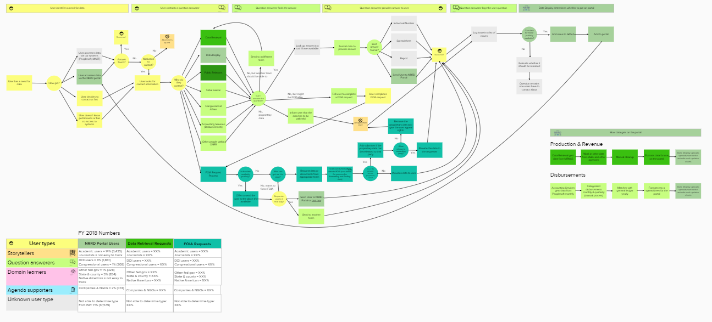

Journey maps, service blueprints, process diagrams…whatever you want to call them, they’re all ways of mapping what happens to help a team come to an agreement on the current state and think about how to improve the future state. They’re a communication tool, but only effective when broadly shared and understood.  Here are two recent examples of journey maps we’ve created and how we socialized them to get agreement on process.

## Information and Data Management journey

Our Data Display team is part of a larger team that includes Data Optimization Retrieval and Coordination, Data Governance, Information Access, External Communication, and Program Support & Project Management. We didn’t have any documentation about how our teams currently work together, so we created a journey map ahead of a team planning session  to show the flow of our work.

Since the Data Display team publishes the data to the website, some assumed that team had the most impact on external people who need the data, so we also wanted to show how each team impacts both users of the website and customers of the data (who may never touch the website). The customer is represented by yellow boxes, and each team is a different shade of green.

[View the full journey map (in Mural)](https://app.mural.co/t/onrr3044/m/onrr3044/1539884716338/7ba6fed4d70c669c753c18cb8610b4f6bb831fe7)

We used an online tool for this journey map because its primary use would be in a large group meeting, and we knew we might want to edit the contents of the map on the fly. It made it easy to update without having to install software. It’s not a perfect tool, but it met the basic needs of our team.

We met with people from some of the teams before the meeting to flesh out areas of the process that we were unfamiliar with and made adjustments in the team meeting for those who couldn’t meet beforehand.

This diagram helped to show how all of our teams impact the customer’s experience, not just the Data Display team.

## Lease journey

Our website currently presents data at the national, state, and county levels, but we heard from users and other stakeholders that they want production data down to the lease-level (i.e. how much oil Company X produced on a particular piece of land they lease from the federal government) to be included, as well. When we got this request, I was still relatively new and had no idea what that meant or how the leasing process works today and what role our agency and our website play or could play in that process.

Before figuring out how users might use the data on the website, I needed to wrap my head around the current state. I initially looked for a diagram of how the process works today, but no one had rendered one. Everybody knows their piece very well, but nobody had documented anything comprehensive. The leasing process and data related to leases touches 5 federal agencies and 14 systems, so it’s no surprise that there wasn’t anything that put all the pieces together.

I started by reaching out to my college, Wendy, on the Data Governance team because I knew she had worked on multiple teams within our agency and had a good idea of the way things worked.  Then I talked with customers of the process and the data in a variety of internal and external roles about how they currently access and use the data and their pain points.

I then turned what I learned into a journey map and fleshed it out further with Wendy and other stakeholders. It started as the basic flow diagram from the customer’s perspective at the top, but it grew to include swimlanes for different actors and systems as we received more information and dug further into the weeds. We needed to figure out all the systems that were touched to even understand what data we would have available to include in a design to meet user needs.

[View the full journey map (PDF)](./LeaseLevelJourneyMap_040519.pdf)

After we created the journey map, staff started circulating it. With increasing interest, more people contributed their knowledge to it. It’s a work in progress and living document, but it’s now being used as an input for a business process reengineering effort a contractor is conducting to look at our agency’s processes in a more comprehensive way.

I decided to use a standard installed process software for this one because the one I previously did using the online tool didn’t get updated by anyone but me anyway and people like to print.  The installed software is better for printing and there are more people who do have it, so they can update the file.

## Journey maps as a communication tool

Whether you call it a journey map, a service blueprint, or a process flow doesn’t matter as long as it meets the needs of the audience. These are all conversation tools; their job is to facilitate discussion and understanding about the problem. These things aren’t useful tools if they’re not made available for people to use and comment on.

Whether used at a high level, or down to the smallest detail, sharing by visual mapping can be invaluable for documenting, understanding, and collaborating on any kind of process. Creating a visual image engages people in ways that a meeting or text sometimes can’t and shows crossovers that most don’t know exist.

It’s also important for the tool to be shareable because it facilitates collaboration across silos and improves knowledge sharing throughout an organization. I talked with one employee who created a version on paper several years ago, but that documentation was lost over the course of cube moves. Choose a tool that makes it easy to share with your audience.

Don’t get hung up on whether you’re doing it right. Think of it as a design problem where you identify what is and isn’t working in the diagram and adjust as necessary.
