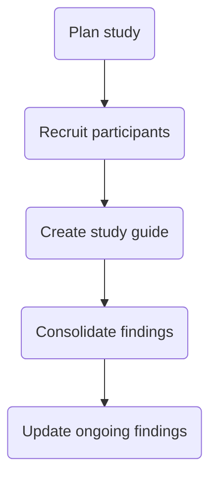

We have a small team: a product manager, one developer, one designer, one content strategist, and 3 program analysts. Our analysts are subject matter experts who know the site’s data, but they split their time between working on our website and managing a committee. To stretch our team further and make all of us better, we’re always looking for cross training opportunities.

Our user experience designer has been running the usability testing process – from recruiting participants to building prototypes – by herself. As the website grows in scope, it takes up an increasing amount of her time. As such, we decided it would be helpful to peer-train two of our program analysts to conduct usability testing. Prior to the training, both analysts had participated in usability testing by taking notes throughout user interviews and helping to summarize the interview sessions. Since the [Paperwork Reduction Act](https://github.com/ONRR/doi-extractives-data/wiki/What-you-need-to-know-about-doing-design-and-research-in-the-federal-government) prohibits us from recording user interviews, our team takes notes and debriefs right after the sessions to make sure we didn’t miss anything important.

### Usability testing design process

