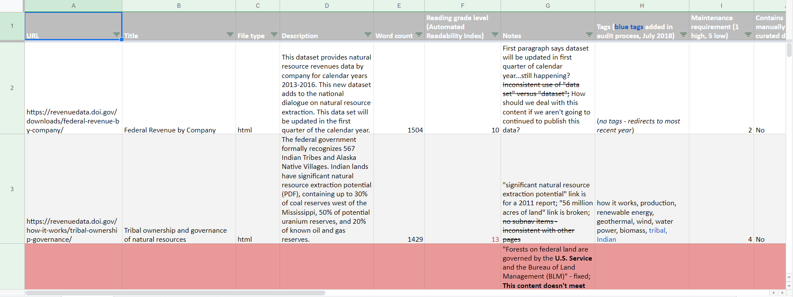

Over the years, I've found the discipline of content strategy to be...malleable. Sure, there are principles that guide the overarching approach, but the day-to-day mechanics of the job are shaped by the organization's culture, its mission, the composition of the team, and the history and trajectory of the product itself, among other variables.

Common to every content strategy I've developed is an unavoidable outcome: we must make tough content choices.

## A brief history

[Natural Resources Revenue Data](https://revenuedata.doi.gov/) was originally built by [18F](https://18f.gsa.gov/) to support the United States' participation in the [Extractive Industries Transparency Initiative](https://eiti.org/) (EITI). The site served as an interactive version of the EITI annual report, required by member countries of EITI.

In practice, here's what that meant for the site's content strategy:

- The [EITI standard](https://eiti.org/about/how-we-work#implementing-the-standard-nationally) mandates the formation of a multi-stakeholder group to define how EITI will work in the respective country. For the U.S., that meant, in part, that group formed the content governance for the site.
- The standard requires each country supply an independent administrator, a non-governmental entity to help coordinate the implementation of the standard. In our case, it was an outside contractor, the staff for which also developed much of the site's content.
- The scope of data and content under EITI went beyond the federal government's management and regulatory authority over extractive industries and included data and content related to the economic impact of the extractives sector on local economies and Gross Domestic Product.

Basically, The EITI standard provided the scope, vision, and governance for the site.

## A new reality

In late 2017, the [U.S. withdrew from EITI](https://revenuedata.doi.gov/about/#history). The site would live on, but the content strategy would need to change. 

Meanwhile, [18F was transitioning the work to our team](https://18f.gsa.gov/2018/05/01/lessons-from-an-18f-product-transition/). We no longer had our governance structure, outside content creators, the developers who built the site, or the EITI standard.

So what now? 😟

## Making tough content choices

Our problem was a common one: we needed to define our new constraints, and evaluate user needs and our ability to meet them within those constraints.

We started by reframing the product vision.

## Defining our constraints

I didn't fully realize at the time how important our [product framing](https://github.com/ONRR/doi-extractives-data/wiki/Product-framing) would be. It can be difficult to allocate the time to do this important, guiding work when you're trying to onboard a new team and continuing shipping features. But without it, each decision becomes more difficult and subjective, with no North Star to mitigate personal preferences, difficult choices, or pain points.

We took a couple of weeks (a sprint) to redefine our purpose and constraints, which included several elements:

- [Problem statement](https://github.com/ONRR/doi-extractives-data/wiki/Product-framing#problem-statement)
- [Product vision](https://github.com/ONRR/doi-extractives-data/wiki/Product-framing#our-vision)
- [What we're _not_ trying to do](https://github.com/ONRR/doi-extractives-data/wiki/Product-framing#what-we-are-not-trying-to-do)
- [Product risks](https://github.com/ONRR/doi-extractives-data/wiki/Product-framing#risks)
- [Prioritization scale](https://github.com/ONRR/doi-extractives-data/wiki/Prioritization-Scale)

With our product framing toolkit assembled, we could now audit and evaluate content against our agreed upon constraints and aspirations.

## Content auditing

I'm certain there are people out there for whom auditing content is a dream come true; I am not one of them. I do, however, cherish the role of content auditing in the practice of content strategy. You simply can't move forward with a strategic vision without taking into account the existing disposition of site content.

The content audit isn't simply an inventory of existing content; it endeavors to capture characteristics of the content that impact our decision making. That is, we're not only evaluating content according to alignment with our revised product vision, but also trying to understand the previous and current governance of the content, its relative maintenance requirements, and its value to users. In doing so, we reveal the limits of user-centered content design: your team has to be capable of delivering on the user needs you've identified. So that's where we head next...

## User needs are just part of the equation

Our team tries to take a holistic approach to identifying user needs. We examine analytics, we interview users, we iterate and conduct more research...our process starts and ends with users in mind.

But here's the truth often suppressed when discussing user-centered design: user needs are part of the equation, albeit an integral part. Your team's ability to deliver on user needs is an avoidable constraint.

So how do we go about weighing user needs relative our team's capacity to deliver on them?

### Content evaluation and prioritization

Excuse the use of the word "prioritization" here. It's an overly artful term for which I've struggled to find a sufficient alternative. The point is, you can't do everything. You have to make tough choices. Here's an example.

In the EITI era, our site contained data and supporting content for domains outside the scope of our revised product vision. Our data included:

- National and state GDP for the overall extractive industries sector
- Wage and salary data for the overall extractive industries sector
- Case studies for counties with significant economic reliance on extractive industries
- National extractive industries production from all land categories (private, state, and federal)

We could tell from our analytics that this data was useful to some 