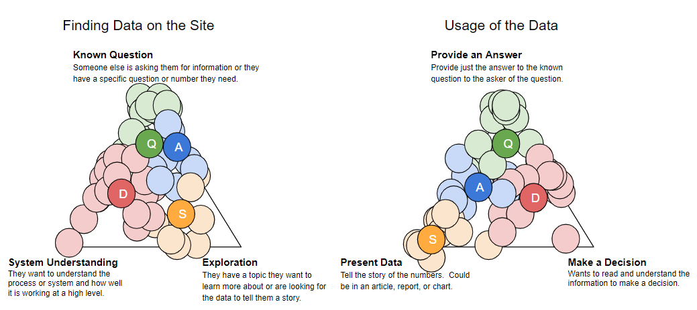

“We are informing policy debates and raising public awareness by building the definitive source of timely and useful data about how the government manages federal energy and mineral resources, revenue, and disbursements.”

That is the vision statement for our website. It’s a lofty goal and a big lift to expect of opening up some government data, but we think our work is one small piece of building trust in government.

## Why open up data
Open data enables governments to be inclusive by providing universal access and transparency into government operations. This gives the public the information needed to back up claims made in the name of social justice with facts. The U.S. government has several mandates for agencies to open up data and make it available to the public, but making data available is only the first step to making the data useful to a diverse public audience. To make government data truly open, accessible, and inclusive, government agencies need to include their users in the design process. Every time I speak with a user, I’m reminded about the importance of government transparency and how open data plays an important role in facilitating transparency.

## Old focus: External constraints
The current vision wasn’t always the vision of the site. In 2012, the Office of Natural Resources Revenue (ONRR) wanted to create an open data site to support the Extractive Industries Transparency Initiative (EITI), which is a global effort to promote open and accountable management of natural resources. To support this initiative, ONRR (along with consultants) created the U.S. EITI portal to be an interactive version of the annual report required by the EITI. It was largely designed to meet the specific report requirements, which were driven by a stakeholder group and their interests.

In addition to the U.S. EITI portal, ONRR maintained a separate page aimed at an audience who generally knew what they were looking for and was often used by people internal to government. It allowed users to select the data they wanted to view and then download the selected data in a spreadsheet. This site was maintained by an external contractor and decommissioned because ONRR wanted one consistent source of publicly available data on the portal that didn’t require the use of a contractor and their proprietary tools. It had also gotten out of date and didn’t include all of the datasets available on the open data site.

In 2017, the U.S. withdrew as an EITI implementing country, but ONRR made a commitment to continue providing open data in the spirit of the initiative because the organization’s leaders value providing public access and transparency into our operations. That commitment, along with a renewed presidential mandate to enhance data transparency and improve users’ experiences with government services, informed the new site vision and led to the creation of my team.  

## New focus: Humans
Now our core focus has shifted from meeting specific EITI requirements to meeting the diverse needs of the people who use our site, and we have amplified our efforts to design with users. My role as UX designer and researcher is to make sure we understand who uses our site and how they use the data. One challenge I’ve encountered in refocusing the site is finding our users. Since we have a very unique audience, I’ve had to get creative and do a lot of outreach with the public.

As I’ve talked with more and more users, I’ve discovered they differ primarily in two areas: how they find data on the site and how they use the data after they find it. They fall into four primary user types: Question Answerers, Agenda Supporters, Storytellers, and Domain Learners. The unlettered circles in the image below represent users we’ve interviewed over the last year or so. The ones with letters represent the summarized user types.

User type summary of where participants across studies have fallen.

Question Answerers generally come to the site with a known question and need to provide the answer to that question directly to the person who asked it. A large portion are internal ONRR analysts who field questions from external audiences and previously used the decommissioned internal site. Congressional staffers also often fall into this user type.

Question answers

Agenda Supporters are people who work for organizations, such as non-governmental organizations (NGOs), or are political appointees or congressional staffers who are committed to a cause. They look for data to support their cause and may revise their agenda based on what they find from exploring the data. They generally want to take action based on their agenda.

Agenda supporters

Storytellers are often journalists and academics who want to understand what is happening and learn from the data whether there’s a story to tell. They also come to the site when they already have a story in mind and need a number or want to flesh it out with information from multiple sources. Their primary goal is to tell the story in a compelling and factual way.

Storytellers

Domain Learners are engaged at a higher level and want to understand the bigger picture. They are in charge of a domain, such as a federal government agency, state, county, or Native American tribe and want to know what is going on in that domain. They need to make decisions and answer questions based on what they see in the data.

Domain learners

We now ask every user we talk with about their behaviors and have been refining our understanding over time. You can see that we moved the Storyteller and Domain Leaner locations on the triangles as we saw the real users clustering in places we didn’t expect.

## Design iteration
The site was originally designed under the assumption that users wanted the data to tell them a story, but our research has shown that even Storytellers tend to have a question in mind when they come to the site. Most users’ primary focus is finding an answer to that question. Once they find their answer, they may drop the numbers into an email, article, or report, or create a chart to explain the answer.

The charts on the site, which were created to make an interactive version of the EITI annual report, don’t easily facilitate finding answers to most specific user questions. We’ve heard from several users that charts are nice if they happen to answer the specific question in mind, but they would prefer to have all the data available in a format that can be filtered to derive the answer to a specific question without having to download the data and use pivot tables. We’ve started to add [filterable tables](https://revenuedata.doi.gov/explore/revenue/) to the site to meet this user need.

Our research has also shown that users want as much data available as possible, so they can understand the entire picture and make their own conclusions. Without the EITI driving the direction of the site, we have the flexibility to make any non-proprietary data available. This flexibility is allowing us to expand the scope of the site and prevent users from having to contact us for data or submit a Freedom of Information Act (FOIA) request, which can be a year-long process. For example, we’re planning to add data at the lease level as a result of this user need. We have a lot of work to do to get the site ready for that amount of data, but we’re working on it. We also added monthly data because of user requests.

Once we started showing users designs with more data on the site, new users (in particular) started to get overwhelmed and didn’t know where to focus their attention on the site. The site could do a better  job of explaining what’s available and how to get to the needed data. We’re continually exploring designs focused on explaining what’s available and how the pieces fit together before presenting the data. Every time we add a new piece of data to the site, we need to think carefully about how it fits with the rest of the picture to ensure we don’t impede users’ ability to see how it all fits together.

## Conclusion
Through user-centered design, and no longer being constrained by external requirements, our open data site is becoming a more transparent view into the operations of our agency and more inclusive of the needs of our users. It is better able to support our vision to inform policy debates and raise public awareness by building the definitive source of timely and useful data about how the government manages federal energy and mineral resources, revenue, and disbursements.
