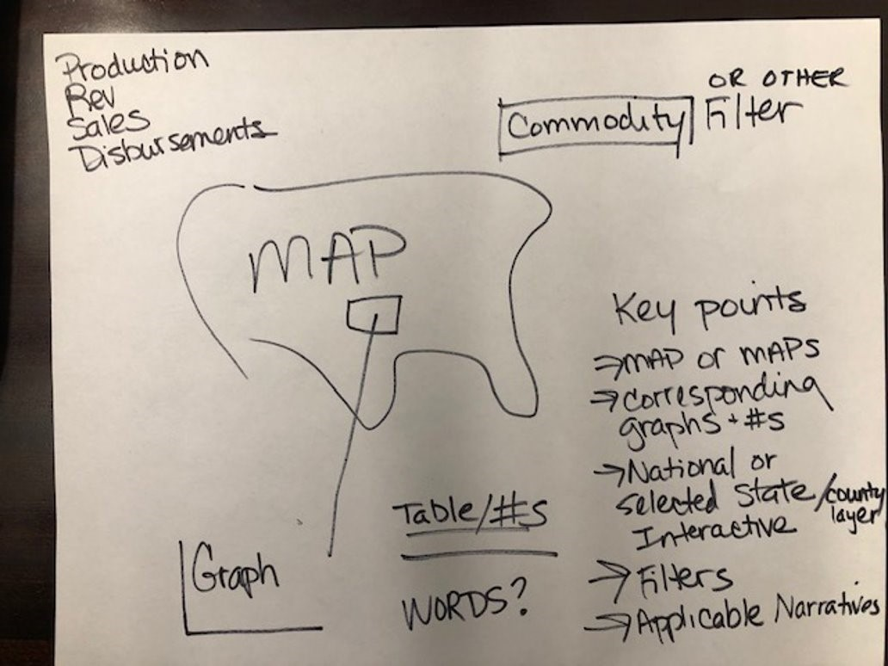
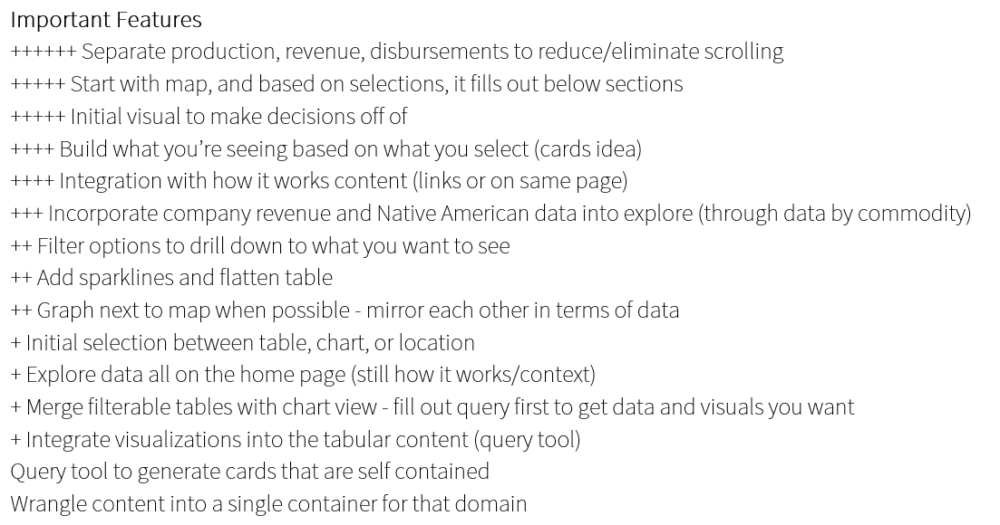
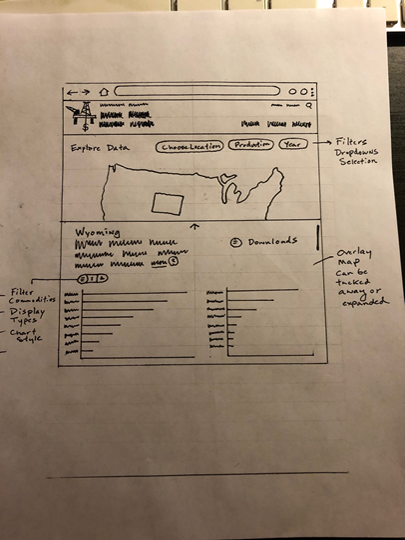
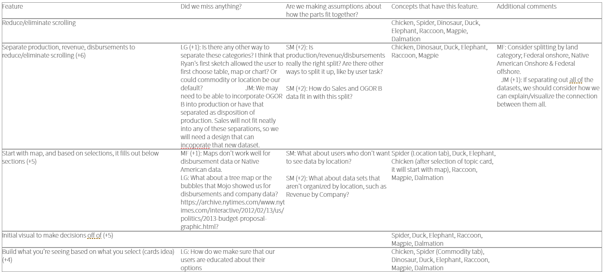
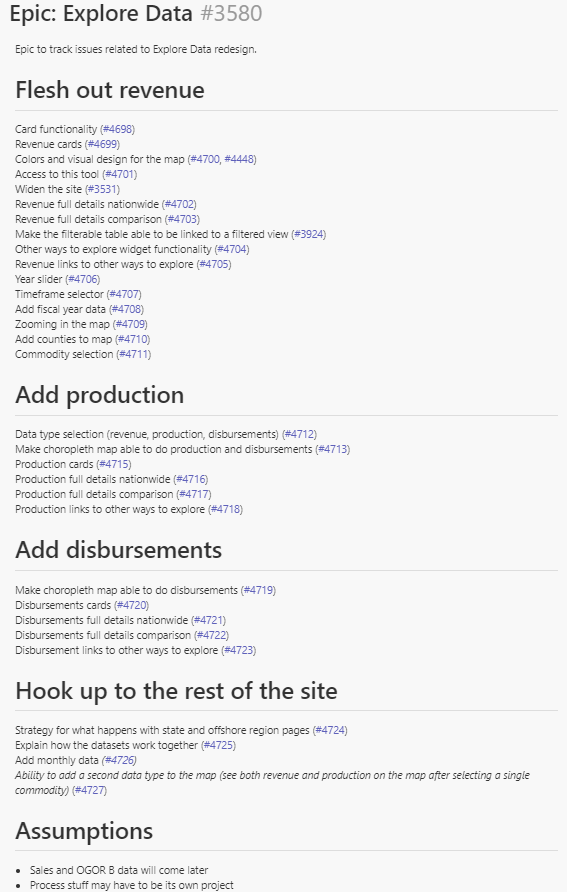

## How we work remotely

The Office of Natural Resources Revenue (ONRR) is a relatively telework-friendly agency and has allowed full-time telework for qualified positions since May 2017 and some telework throughout its 10-year existence. In addition to remote employees, the agency has offices located in several cities across the country including Washington D.C., Denver, Dallas, Oklahoma City, Houston, Tulsa, and Farmington, New Mexico. Because of this, the agency is committed to creating a seamless work environment that empowers employees regardless of their location.  

When our innovation design team was created, two members of our team were the first fully-remote employees who don’t live near an agency office, and we’ve been testing the infrastructure as a result. For instance, we’ve learned we have to follow special procedures when resetting computer passwords or risk a lock out that requires taking your laptop to an office (I learned that one the hard way!).

On a day-to-day basis, our entire team is distributed, making it essential for us to collaborate virtually. We’ve had team members in California, Colorado, Indiana, Oregon, Maine, Maryland, Massachusetts, New Mexico, Virginia, and Washington, D.C. As such, we follow general best practices for remote work that we’ve documented on our [wiki](https://github.com/ONRR/doi-extractives-data/wiki/Basics-for-making-distributed-work-work).

We also conduct all of our user research sessions using video conferencing, which allows us to reach users wherever they are and at a convenient time for them. This flexibility also makes it easier to find participants, which is critical since we have a pretty niche audience, and we aren’t able to offer incentives to study participants.

## Remote design studios

One of the things that has taken the most effort to get to work well remotely is design studios. We conduct design studios at the beginning of larger projects when we’re doing things like adding a new feature or extensively redesigning an existing one. The purpose is to get everyone on the team to be on board with the project and on the same page with the problem we’re aiming to solve.  We also want to get as many ideas onto the table as possible before committing to a given solution.

Given how distributed we are, it’s often not possible to get us all in the same room at the same time. Once, we tried conducting a design studio from both DC and Denver, and that didn’t work very well. It lacked the all of benefits of being in person because we were in two rooms and still had more drawbacks than it would have if we were all remote. We even had smart whiteboards, but had to spend a significant amount of time figuring out how to get them to work and ended up just taking cell phone pictures of sketches instead.

After that attempt, we decided to try doing a design studio completely remotely.  It was also in conjunction with an attempt to slow down agile a bit to improve the feedback we got on designs and get the whole team more engaged in thinking about the details. The process of slowing down agile was inspired by Basecamp’s free, online book [Shape Up: Stop Running in Circles and Ship Work that Matters](https://basecamp.com/shapeup) by Ryan Singer (Note: this isn’t an endorsement of Basecamp). To slow down the process, we decided to break it down into 4 two-hour meetings with each person assigned homework in between meetings.

The process improvements we wanted to make were to improve long-term thinking and communication and collaboration throughout the design and build process. We wanted to stop throwing things over the wall every two weeks and truly get everyone involved in every step, particularly because one of the goals of our team is to train program analysts in digital skills.

## Design studio process

Here’s what our process looked like:

Meeting 1: Define project scope
* Started with a raw idea
* Reviewed existing [analytics and user research data](https://l3brpd.axshare.com/#id=yugjv4&p=home&g=1) and [journey maps](https://l3brpd.axshare.com/#id=izehea&p=journey&g=1) demonstrating the problem
* Finalized the problem we wanted to solve in our collective words
* Determined the “appetite” or the amount of resources we were willing to dedicate to solving the problem.

Offline week 1: Sketching ideas
* Generated ideas to solve the problem in the stated appetite
* Documented the key features of each idea

Image: Round 1 sketch

Meeting 2: Sketch review
* Reviewed sketches
* Ranked features based on how much each contributed to solving the agreed upon problem

Image: Ranked feature list

Offline week 2: More sketching
* Used the ranked features to frame a second round of idea generation

Meeting 3: Sketch review & option narrowing
* Reviewed second round of sketches
* Chose a single option to move forward with

Image: Round 2 sketch

Offline week 3: Hole poking
* Poked holes in the selected option to make sure we were thinking of all the consequences of our chosen solution to prevent surprises from coming up later.

Image: Hole poking matrix

Meeting 4: Hole poking review and scope to build
* Reviewed hole poking
* Figured out the [pieces we’d need to build the solution](https://github.com/ONRR/doi-extractives-data/issues/3580)
* Prioritized the list of pieces to order our work for detailed design and building.

Image: List of pieces to build the concept

Final offline activity: I created a [high-level prototype](https://935313.axshare.com/#g=1&p=revenue_1) of the chosen option including the pieces we decided we wanted to build.

## Lessons learned

With in-person design studios we were limited to one to two days, but doing it remotely allowed us the flexibility to spread things out and allow time and space for thinking. We used meeting time to review & build consensus and offline time for thinking.

We also have some people on our team who are new to designing and building websites and they didn’t know how to provide feedback when asked. The process we used provided a framework and guardrails for everyone on the team to provide constructive feedback and participate in the process. As a result of the structured process and added thinking time, more members of the team provided input when reviewing the designs in these meetings and subsequently when working through the details during the detailed design and build phase.

Sketching offline allowed everyone to use whichever tool they are most comfortable in. For example, some sketched on paper, some used word processors or spreadsheets, and I used a prototyping tool because I like being able to move things around. Not having the pressure to draw on demand really opened up the floodgates for the ideas to flow.

Some people thought the process was more collaborative than our previous design studios because more people spoke up and contributed ideas, but some thought that not having the in-person component made it feel less collaborative. To address the concerns, we’re going to try having one of the meetings be in person or do more of the offline work in pairs for the next project.  
