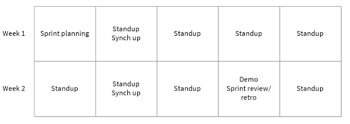
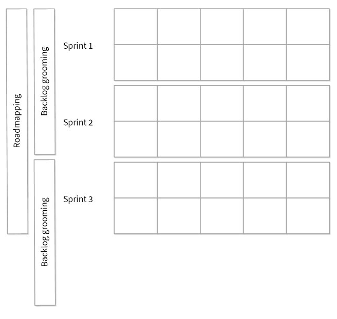
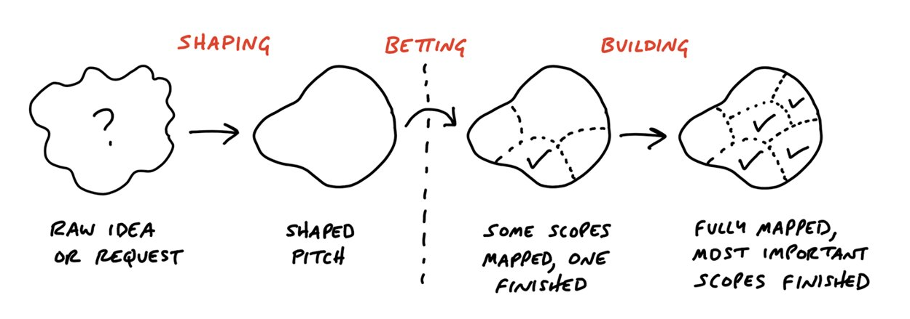
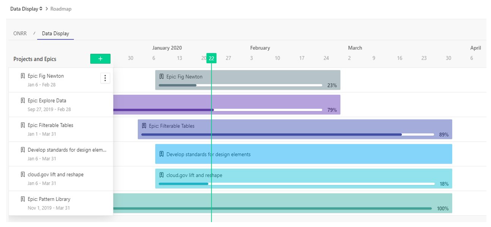
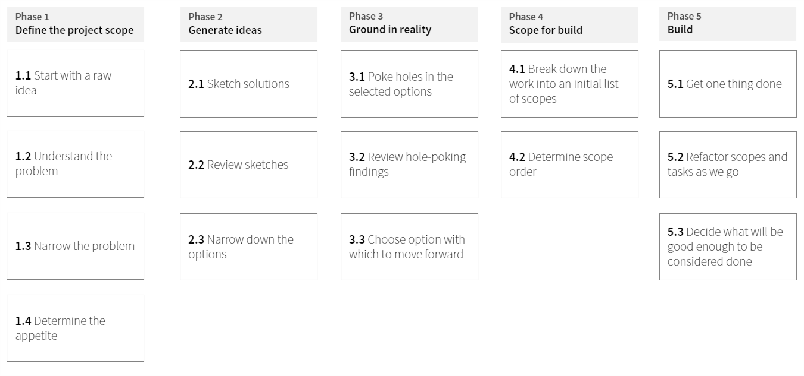
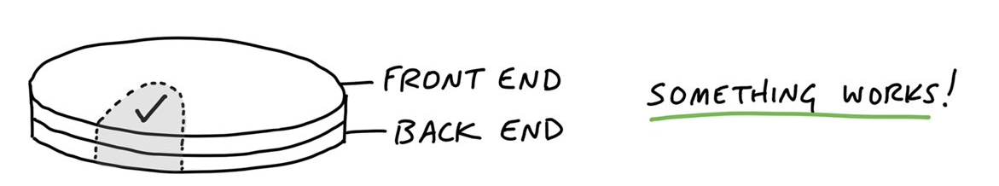
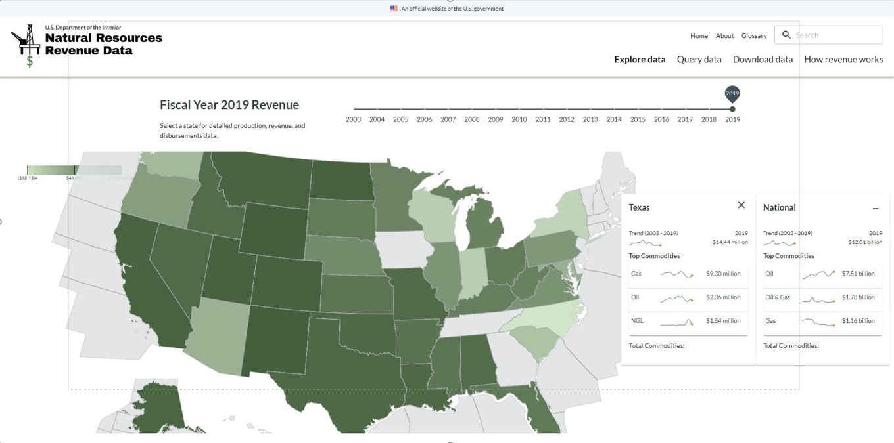
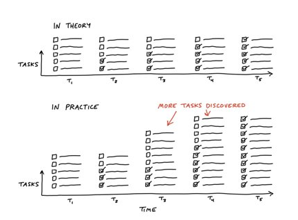
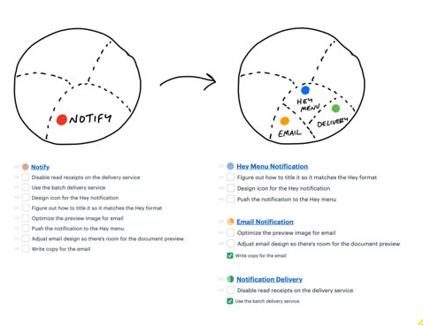
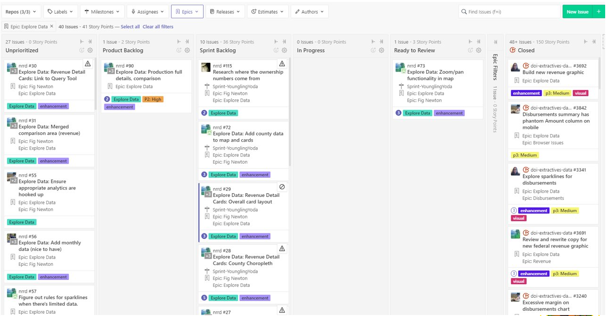

Most of us in government have by now heard the familiar phrase: The strategy is delivery. (Or its variant: Delivery is the strategy.)​ It’s a useful phrase. ​

​Bureaucracy is real, and government can move slowly, so we sometimes fail to meet rising expectations from the public. ​ ​But what happens when our focus on delivery impedes our ability to properly scope features?  ​Or results in a siloed team, where everyone is ‘throwing work over the wall’ to the next team or team member?  ​Or we fail to consult our subject-matter experts, or adequately include team members with less digital experience?  ​

Our team recently faced these challenges with our implementation of agile. ​

We needed to find a way to properly scope features, prioritize our work, and encourage collaboration and co-working through the full research-to-release lifecycle, while continuing to ship features.​ We  thoroughly evaluated our work processes, and drew on outside inspiration to slow down and improve collaboration as we designed and built site enhancements.   

## Our process--before

Before we get into our solution, ​here’s a look at what our process ​looked like prior to our adjustments. ​

We worked in two-week sprints that include daily standups, sprint planning, weekly synch up, sprint demo, and sprint review/retro.​ We decided what individuals worked on at the beginning of each sprint, based on goals defined for the sprint and our velocity estimates.​  

Prior to adjusting our process, we aimed to have everything assigned and completed within the two-weeks sprints. This included user research, design, content strategy, development, analysis, and pull request reviews. ​

We also did some longer-term planning in the form of roadmapping. We held a one-hour roadmapping session every six weeks to discuss where we want to go in the coming six weeks. While our focus was the next six weeks, we also touched on longer term goals that would take more than six weeks and tried to break those down into goals that would be accomplishable within six weeks.​

We also met once a month for an hour for backlog grooming to validate and prioritize issues and estimate the effort required to work the issues in our backlog.  

When we determined that we needed to make significant enhancements to the site to address needs we’d discovered through user research, we held one to two-day design studios to dig into the problems and design potential solutions collaboratively as a team.

## Evaluating our agile process

We are dedicated to getting the most out of agile—and that includes an openness to adjust our implementation of agile. So, when members of the team were concerned about our collaboration and processes, we wanted to do better. First, we conducted a retro on the existing process to get into the details of  what was working and determine which problems the team wanted to solve.​  

Here are the results of that retro.

What was working:​

* 2-week sprints allow us to pivot relatively quickly.​
* With many remote members, our daily standups facilitate connection. ​
* Retro is effective at exposing frustrations and pain points.​
* Multiple team members are looking at and improving content.​
* User research allows us to understand user needs.​
* Prototyping allows us to test out options with users quickly before spending time building them.
* We’ve made a lot of improvements to the tech stack and code and addressed some tech debt.​
* We were training and co-working with program analysts to teach them user research and content management skills.​

Short-term thinking problems:​
* We often ended up focusing on what individuals could do within the coming two weeks, without much long-term thinking and consensus building about the direction we wanted to head in. ​
* We often rolled over work to the next sprint, which largely defeats the purpose. ​
* Sprint planning and roadmapping often felt disconnected.  ​
* Roadmapping was a high-level look at the long-term direction, but it wasn’t detailed enough to make sure we were all on the same page with where we wanted to go. ​
* We also had a separate project plan for upper management and a content calendar that didn’t always align with the roadmap. ​
* We didn’t have a shared understanding of what was a priority. ​

Collaboration & communication problems:​
* We often didn’t have a shared understanding of the problem space. ​
* We weren’t bringing the team’s full expertise to evaluating and scoping our new work. ​
* We didn’t leave time for iterating the design during development. ​
* Moving too fast resulted in “throwing things over the wall” and a lack of collaboration because we were all focused on doing our individual tasks in a given sprint. ​​

## Our inspiration

We found inspiration in Basecamp’s free, online book <a href="https://basecamp.com/shapeup">*Shape Up: Stop Running in Circles and Ship Work that Matters*</a> ​by Ryan Singer​ (this isn't an endorsement of Basecamp). Many of the examples and illustrations you’ll see below are from that book.

In the book, Ryan Singer details how they follow a process called “shaping” to develop their ideas when framing a problem to be solved. Shaping involves taking a raw idea and turning it into a scoped piece of work that is ready to be built.

From <a href="https://basecamp.com/shapeup/4.1-appendix-02">*Shape Up*, Appendix 2</a>

Shaping has three main properties described in *Shape Up*

### Property 1: It’s rough​

“Everyone can tell by looking at it that it’s unfinished. They can see the open spaces where their contributions will go. Work that’s too fine, too early commits everyone to the wrong details. Designers and programmers need room to apply their own judgement and expertise when they roll up their sleeves and discover all the real trade-offs that emerge.”​ From <a href="https://basecamp.com/shapeup/1.1-chapter-02">*Shape Up*, Chapter 2</a>

### Property 2: It’s solved ​

“Despite being rough and unfinished, shaped work has been thought through. All the main elements of the solution are there at the macro level and they connect together. The work isn’t specified down to individual tasks, but the overall solution is spelled out. While surprises might still happen and icebergs could still emerge, there is clear direction showing what to do. Any open questions or rabbit holes we could see up front have been removed to reduce the project’s risk.”​ From <a href="https://basecamp.com/shapeup/1.1-chapter-02">*Shape Up*, Chapter 2</a>

### Property 3: It’s bounded ​

“Lastly, shaped work indicates what not to do. It tells the team where to stop. There’s a specific appetite—the amount of time the team is allowed to spend on the project. Completing the project within that fixed amount of time requires limiting the scope and leaving specific things out.”​ From <a href="https://basecamp.com/shapeup/1.1-chapter-02">*Shape Up*, Chapter 2</a>

## How we used shaping​

When thinking through how we could keep the aspects of our process that were working well while also incorporating the *Shape Up* methods we thought might solve some of our problems, we decided to continue with 2-week sprints, but put more emphasis on epics (in the book, they focus on 6-week cycles), and incorporate ​“shaping” into the process for new features by bringing everyone around the table to define the work at the appropriate level of abstraction​.

### Epics

We discovered a lot of the features we were working on were better viewed through a longer timeframe than two weeks because we were rolling over a lot of our sprint tasks to the next sprint.​ Because we were using a roadmap, we were already looking at a 6-week horizon, but we weren't as focused on the roadmap as the 2-week sprint schedule.​

Reframing the roadmap chunks of work as epics has helped us take a wider view of our priorities to identify trade-offs, better coordinate our work, and identify blockages or dependencies.​​  We kept the two-week sprints within epics instead of making a wholesale conversion to 6-week sprints to better manage the “metabolism” of the work.​

 

### Shaping new features

Our version of shaping includes five phases: defining the project scope, generating ideas, grounding in reality, scoping for build, and building.

  

We covered the first four phases in a [detailed case study](https://revenuedata.doi.gov/blog/remote-design-studio/)  demonstrating how we used the shaping process in a series of virtual design studios to redesign the Explore Data section of our website.

After the design studio, we started building the product.

## Building using this new method​

At the end of the series of design studios, we split up the pieces of the project into scopes for building.  We ordered them such that it was easy to get one, highly-visible piece done to build momentum and quickly show progress.  We also ordered all the pieces to the importance of what needed to be done first in terms of priority and dependencies.

  
From <a href="https://basecamp.com/shapeup/3.2-chapter-10">*Shape Up*, Chapter 10</a>

The key to getting one thing done is to identify something that is core functionality that shows the novel capabilities you want to improve with a new feature.  For us, we decided that it would be the map.  We had already started building a new map for revenue, so it was also an easy place to start in addition to being a core piece of the new design.

As we progressed through the build phase, we assigned each task to a mini-team including a developer, designer, and program analyst, to ensure we were working out details together instead of throwing anything over the wall.  However, we did end up splitting design and development tasks into separate issues for some of the bigger pieces to avoid having issues roll over to a second sprint. We also adjusted the tasks as we learned more throughout the build process.  The list got a lot longer when we realized we needed to build a database to support the new features, so we had to move to a new platform and basically rebuild our entire site.  We had known for awhile that we would eventually need a database to expand the data we provide and add new features to the site, but the scope of work involved with the platform shift and database slowed down our progress on the new Explore Data feature, making it a fuzzy list of tasks needed for rebuilding the site vs. building Explore Data.  

How the number of tasks increases over time:

From <a href="https://basecamp.com/shapeup/3.3-chapter-11">*Shape Up*, Chapter 11</a>

How details are fleshed out as you build:

From <a href="https://basecamp.com/shapeup/3.3-chapter-11">*Shape Up*, Chapter 11</a>

What our task list looked like halfway through the project.

The *Shape Up* book stresses the importance of defining done against a baseline of what customers already have versus some perfect ideal. As we progressed through the issues, we came up with a definition of when we would be done and decided to do a soft launch to enable us to start providing benefit to users while working out some of the harder or less important kinks for the hard launch. This also allows us to obtain input and feedback from users to make sure we didn’t miss anything big with our re-design.

One of the tasks we put off until after the soft launch was working on the search engine optimization from pages that exist on the site today but do not exist in our rebuilt site.  We defined it as being ready for soft launch as when all the data was accurate and no major bugs for things that were present in the site.  Ready for hard launch is in a state where we don’t lose anything valuable by replacing the old site with the new one.  At that point we went through all the issues with that lens and identified which were required for the soft launch, which were required for the hard launch, and which could wait until later.

## Final deliverable

We released the <a href="https://beta-nrrd.app.cloud.gov/">soft launch</a> a couple of weeks ago and are diligently working through all the things we need to do to be ready for the hard launch.

## Lessons learned

We’re still learning how to do this. We definitely solved many of our communication issues by doing the up-front shaping work and working collaboratively on issues instead of throwing things over the wall.

What we’re still not good at is estimating. This project has taken more time than our initial appetite – mostly because we had to rebuild the whole site to get the database. We probably bit off more than we knew with redesigning such a core part of our site and changing our process at the same time, but  we expect this large scope of work will add a lot of user value with the introduction of our new features. The infrastructure we’ve put in place will also provide our team more flexibility and opportunity to deliver future value to users through new, expanded datasets and tools.
