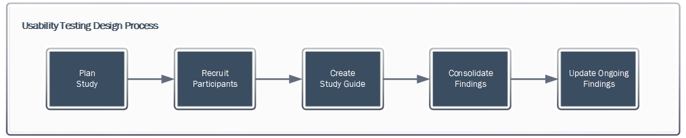

We have a small team: a product manager, one developer, one designer, one content strategist, and 3 program analysts. Our analysts are subject matter experts who know the site’s data, but they split their time between working on our website and managing a committee. To stretch our team further and make all of us better, we’re always looking for cross training opportunities.

Our user experience designer has been running the usability testing process – from recruiting participants to building prototypes – by herself. As the website grows in scope, it takes up an increasing amount of her time. As such, we decided it would be helpful to peer-train two of our program analysts to conduct usability testing. Prior to the training, both analysts had participated in usability testing by taking notes throughout user interviews and helping to summarize the interview sessions. Since the [Paperwork Reduction Act](https://github.com/ONRR/doi-extractives-data/wiki/What-you-need-to-know-about-doing-design-and-research-in-the-federal-government) prohibits us from recording user interviews, our team takes notes and debriefs right after the sessions to make sure we didn’t miss anything important.

## Process

Prior to our training, our UX designer documented her [usability testing process](https://github.com/ONRR/doi-extractives-data/wiki/Usability-Testing-Process), and the program analysts read [A Practical Guide to Usability Testing](http://redish.net/books/item/44-a-practical-guide-to-usability-testing) by Joseph S. Dumas and Janice (Ginny) Redish to learn the nitty-gritty skills involved in conducting user research. The analysts were already familiar with some pieces of the process, but our UX designer shared all the details about how she goes through the process, including how she recruits participants, prepares for the interviews, and pulls together the findings following the study. After going through the process and reading up, we decided that the best way for the analysts to learn would be to conduct a mock study themselves.

## Planning

Using the outlined process, the analysts each put together a [study plan](https://github.com/ONRR/doi-extractives-data/blob/research/research/training-study/training_study_plan_and_guide.md) to test a [prototype for a new design](https://4cawh1.axshare.com/yearly.html) we hadn’t yet tested with users. They both presented their plans for feedback from the UX designer and then combined the best parts of both to create the version they used for the mock interviews.

After they had completed their plan, the analysts created a [study guide](https://github.com/ONRR/doi-extractives-data/blob/research/research/training-study/training_study_plan_and_guide.md) for the user interviews and first practiced interviewing each other. Our UX designer then recruited colleagues to serve as our users. We asked some of them to give us their own opinions and some to role play people who fit into our typical user types to give the analysts experience dealing with different users.

## Conducting the study

Our team is mainly remote, so we conducted the interviews over Google Hangouts. One analyst conducted each session and the other one took notes, so both were there for all of the sessions. The analysts conducted a debrief following each interview to make sure everything was captured and practiced placing each participant on our [user type dimensions](https://github.com/ONRR/doi-extractives-data/blob/research/research/00_UserTypes/00_UserTypes.md). The UX designer was also there for all the sessions and provided feedback on facilitation during the debriefs.

## Analysis

After completing the interviews, the analysts consolidated findings using a template we use for all of our studies. They pulled out the highest frequency findings related to specific questions in the study guide and created a [findings summary](https://github.com/ONRR/doi-extractives-data/blob/research/research/training-study/training_study_results.md) to share with the team. As a result of our findings, we made a few tweaks to the design to fix issues that real users would likely encounter, before planning a study of the same design with real users.

## Outcomes

> Learning usability testing was both fascinating and eye-opening. The experience of conducting an interview and analyzing the results stimulated my interest to approach future projects by observing problems and finding solutions by considering different perspectives. - Maroya Faied, Program Analyst

We have limited access to our real user population, so we didn’t want to waste any of our participant pool for a training exercise. We asked our own teammates and a few people from internal teams we work with (shout out to our awesome Data Retrieval team!) to pretend to be different types of users for the mock interviews. When our teammates were playing the roles of users, they were forced to look at the prototype from a different perspective (and in more detail) than they had previously. This allowed our teammates to test the functionality of the design from a user’s perspective and to give constructive feedback based on how people might actually use it. It ended up functioning somewhat like a [cognitive walkthrough](https://www.usabilitybok.org/cognitive-walkthrough) of the design, which we didn’t intend to happen but was a nice surprise. It’s difficult to give feedback on a design when viewing it out of the context of use. Having team members pretend to be users helped them build empathy for those users and look at the design with a more detailed lens than they would in a standard design review.

Our usability testing process is now well documented, such that it will be easier for other team members to pick up it in the future. The program analysts now understand the complexity of the process and realize the amount of planning and background work that is done before the interviews are conducted. They now have completed all of the steps in the process at least once. They have also enjoyed gaining a new skill and getting a peek behind the curtain.

The analysts are already thinking about ways to apply design thinking to our other work processes and future projects. The prescribed work process with an emphasis on planning and documentation helps us stay focused on the task at hand. The planning time helps the work run smoothly and the documentation at each stage makes it easier to spot ways the process and the project could be improved. The attention to documentation makes it easier to share results. It also provides a method to incorporate many viewpoints without creating conflict amongst team members or work groups.

Now that the program analysts are becoming more familiar with the user research process, they have also provided good ideas for improving the process. For example, we will be exploring the use of a spreadsheet instead of documents to take notes, in order to cut out some of the work of copying and pasting from multiple docs into a consolidated spreadsheet when doing analysis. That will also allow us to start coding the findings into like issues as we go.

The next step is for the analysts to plan and conduct a study with real users. Increasing our capacity for user research will help us build bridges with other teams in our agency who are working on products that could benefit from user feedback. We hope to help introduce user-centered design practices to those teams.
