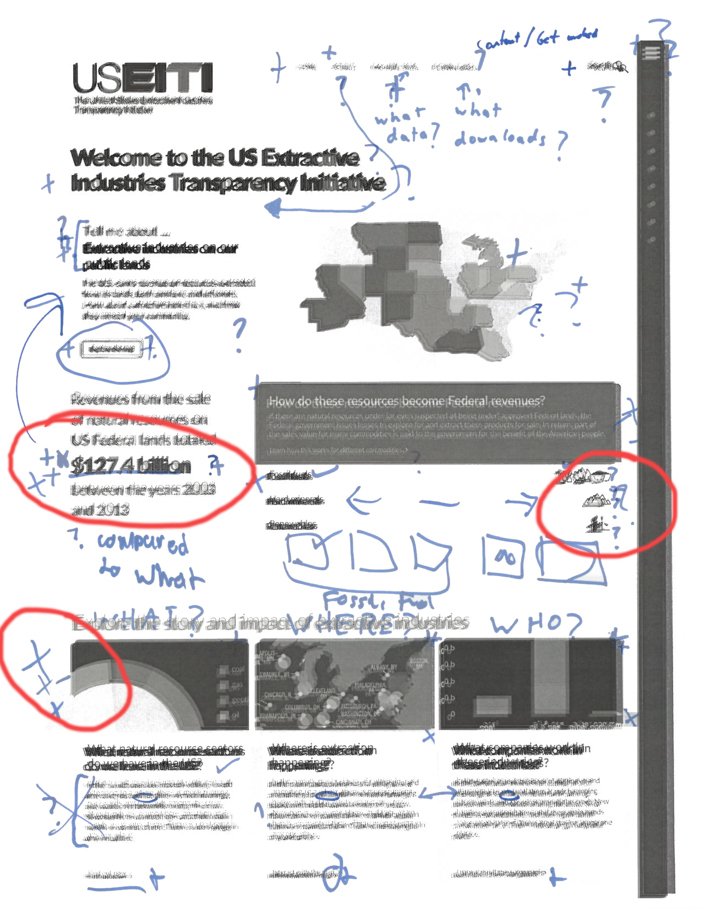
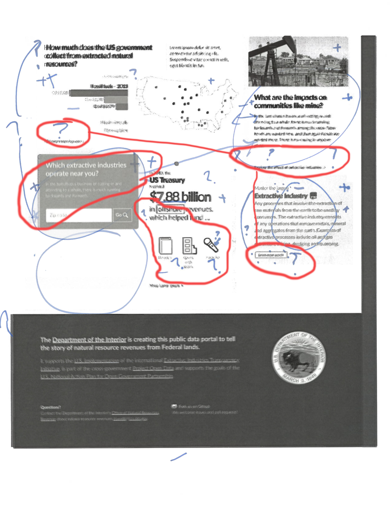

# Sprint 17 usability test results
	

## Hypotheses tested

- Do people understand what the site is about? KINDA!
- Can they figure out how to find and navigate stories? NO!
- Do people understand the term 'extractive resources'? KINDA!
- What problems are most severe? WHAT IS USEITI? WHY AM I HERE? WHAT SHOULD I DO?

## General feedback

### People understand what the site is about generally, but they don't understand the linkage to USEITI or what EITI is

#### What did you learn?

- _We have an transparency initiative for extractive industries_
- _Some human and economic impacts of extraction_
- _I didn’t know that much revenue comes in from these leases_

#### What are you confused about?

- _I don’t really know what the EITI is_
- _You have to get to the back to figure out what the initiative is_
- _At a high level, I still want to understand why this exists (this being the website and initiative)_
- _The word initiative threw me -- why are you telling me any of this? There’s not a lot of background_

### People responded very positively to the three boxes 'after the fold'

- _Cards on the bottom were far more interesting than the above-the-fold material_
- _OH -- now that I’ve scrolled I see ‘what extractive sectors we have in the US’ -- that’s where I could find out what this site covers_
- _This is very clear, WHAT, WHERE and WHO_

### Navigation: inconclusive

Testing navigation on a printout is not ideal, but it seems like other issues were overshadowing nav such that people weren't even getting to that point. It seemed as though people were missing an anchor, somewhere to start from. They understand the site was informational, and for the general public, but what should they be doing here?

- _Which of these should I click first? How do these blocks relate to each other?_
- _Oh this is way longer than i thought it was. I expected it to end after these. Will there be even more?_
- _The more you scroll down, the more likely you are an industry expert, or someone at EITI looking for your information_

## Composite images of printouts with groupings

### Page One

- People were in general interested in the large pull-quote. Some accepted it at face value, others didn't know if they should be impressed or not. How does this value stack up against other national statistics?
- People in general were confused by the 'resources to revenue' block.
- People in general really liked the three-across content block, in particular the 'What sectors?' (first on left) block.

### Page Two

- People really liked the zip code lookup. _Note: We are not sure of the best implementation on this (what should it return, should it be linked to a map, so we even have the right data to support this) and so will be removing it from layouts to test other ideas in the near future, with the hope that we can re-introduce it further down the line._
- People were confused about the icons in the '7.88' graphic. What do they mean?
- There seemed to be a broader confusion about the words associated with 'clicking for more info' in a block. What would they do? What do they mean?

## Process notes

This is the first time we've tried the 'mark up this printout and lets talk about it' approach to usability testing. It definitely had some benefits:

- Fast and easy. We didn't even need a computer and grabbing people on their way to or from somewhere was not too difficult.
- Asking people to interact with the printout in a physical way seemed to help focus discussion. It gave brains something to grab onto.

Some other things to consider:

- You can't test scrolling or other interactions with this method. Will they really see that thing 'below the fold'? This does not answer that quesiton.
- I'm not convinced of the composite image benefit. It is definitely interesting but the greatest value in this exercise might rather be the conversation that the markup enables rather than the markup itself.